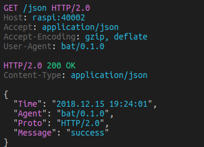

# bat



Go implemented CLI cURL-like tool for humans. Bat can be used for testing, debugging, and generally interacting with HTTP servers.

This repository is a fork of [astaxie/bat](https://github.com/astaxie/bat) making it available for SCION/QUIC.
Refer to the original repository for general usage.

### Usage

bat uses a default localhost address to bind to the dispatcher. You can overwrite localhost by adding a line to `/etc/hosts`. E.g:

```
17-ffaa:1:1,[127.0.1.1]  localhost
```

Then run bat:

```
bat GET https://server/api/download
```

In case you want to bind to a specific address, specify it using the `-l` flag:

```
bat -l ISD-AS,[IP]:port GET https://server/api/download
```

The scheme defaults to HTTPS. The method defaults to GET in case there is no data to be sent and to POST otherwise.

Hostnames are resolved by parsing the `/etc/hosts` file. Known hosts can be added by adding lines like this:

```
# The following lines are SCION hosts
17-ffaa:1:10,[10.0.8.100]	server1
18-ffaa:0:11,[10.0.8.120]	server2
```

### Examples

| Request                                             | Explanation                                                        |
| --------------------------------------------------- | ------------------------------------------------------------------ |
| bat server:8080/api/download                        | HTTPS GET request to server:8080/download                          |
| bat -b server:8080/api/download                     | Run a benchmark against server:8080/download                       |
| bat server:8080/api/upload foo=bar                  | HTTPS POST request with JSON encoded data<br>to server:8080/upload |
| bat -f server:8080/api/upload foo=bar               | HTTPS POST request with URL encoded data<br>to server:8080/upload  |
| bat -body "Hello World" POST server:8080/api/upload | HTTPS POST request with raw data<br>to server:8080/upload          |